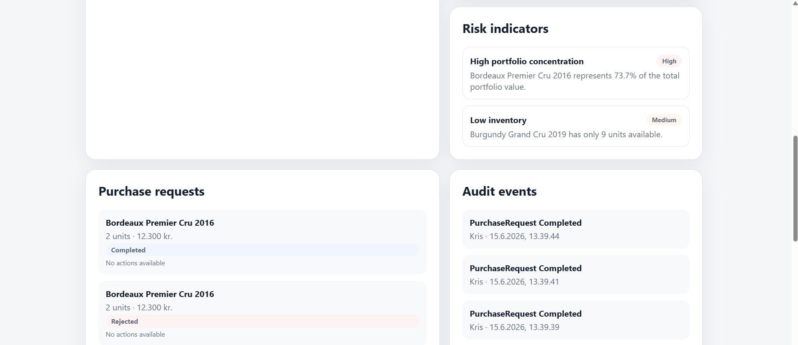

# Asset Portfolio Ops

Asset Portfolio Ops is a cloud-first full-stack demo platform for managing investment assets, customer portfolios, purchase requests, inventory data, portfolio risk indicators and audit events.

The project demonstrates a modern full-stack architecture using .NET, React, TypeScript, SQL persistence, an Azure Cosmos DB-ready audit event store, automated tests and cloud deployment.

The current sample domain uses fine wine as the primary asset type, but the model is intentionally generic and can support other collectible or investment assets.

## Live demo

Frontend:

https://lemon-coast-018ec2603.7.azurestaticapps.net

Backend health check:

https://api-asset-portfolio-ops-dqbeesavemezebhs.denmarkeast-01.azurewebsites.net/health

The frontend is deployed to Azure Static Web Apps Free, and the backend API is deployed to Azure App Service Free F1. The project is intentionally configured as a low-cost portfolio demo.

## Dashboard preview



## Purpose

The purpose of this project is to demonstrate how a full-stack application can support operational investment workflows.

The application shows how a business can manage:

* Investment assets
* Customer portfolio value
* Inventory levels
* Portfolio risk indicators
* Purchase requests
* Purchase request status transitions
* Audit events for operational decisions

The project is designed as a public portfolio project, showing practical software engineering skills in a realistic business domain.

## Tech stack

### Backend

* .NET 10
* ASP.NET Core Minimal API
* Entity Framework Core
* SQLite demo persistence
* Azure Cosmos DB-ready audit event store
* xUnit tests
* Swagger/OpenAPI

### Frontend

* React
* TypeScript
* Vite
* CSS
* Environment-based API configuration

### Cloud and DevOps

* Azure Static Web Apps
* Azure App Service
* GitHub Actions
* Azure DevOps pipeline example
* Cloud-first configuration
* CI/CD build, test and deployment workflow

## Repository structure

```text
asset-portfolio-ops
├── apps
│   ├── api
│   │   ├── Data
│   │   ├── Domain
│   │   ├── Features
│   │   │   ├── Assets
│   │   │   ├── AuditEvents
│   │   │   ├── Inventory
│   │   │   ├── Portfolios
│   │   │   ├── PurchaseRequests
│   │   │   └── RiskIndicators
│   │   ├── Program.cs
│   │   └── AssetPortfolioOps.Api.csproj
│   │
│   └── web
│       ├── src
│       │   ├── App.tsx
│       │   ├── App.css
│       │   └── api.ts
│       └── package.json
│
├── docs
│   ├── architecture.md
│   └── images
│       └── dashboard.png
│
├── infra
│   └── azure
│       └── azure-pipelines.yml
│
├── tests
│   └── AssetPortfolioOps.Api.Tests
│
├── .github
│   └── workflows
│
├── README.md
└── AssetPortfolioOps.sln
```

## Domain model

The backend contains a small investment operations domain.

### Assets

Represents an investment asset such as fine wine, whiskey, art, watches or other collectible assets.

Example asset data:

* Bordeaux Premier Cru 2016
* Burgundy Grand Cru 2019
* Vintage Champagne 2012

### Customers

Represents customers with investment portfolios.

### Holdings

Represents the quantity of a specific asset owned by a customer, including average purchase price.

### Inventory

Represents available stock and warehouse location.

### Purchase requests

Represents a customer purchase request for a specific asset.

A purchase request has a status workflow:

```text
Pending → Approved
Pending → Rejected
Approved → Completed
```

Invalid transitions are rejected by the backend.

For example:

```text
Pending → Completed
Rejected → Approved
Completed → Rejected
```

are not allowed.

### Risk indicators

Represents portfolio and operational warnings based on current data.

The current implementation can detect:

* High portfolio concentration
* Low inventory
* Pending purchase request exposure

This moves the dashboard beyond displaying raw data and into decision support.

### Audit events

Represents important business actions such as:

* Purchase request created
* Purchase request approved
* Purchase request rejected
* Purchase request completed

Audit events are stored behind an interface, so the application can use an in-memory store locally or a Cosmos DB implementation in cloud-ready scenarios.

## Backend features

The backend API supports:

* Reading assets
* Reading inventory
* Reading a customer portfolio
* Reading portfolio risk indicators
* Creating purchase requests
* Approving purchase requests
* Rejecting purchase requests
* Completing purchase requests
* Validating purchase request status transitions
* Writing audit events for purchase request actions
* Reading audit events
* Health check endpoint
* Swagger/OpenAPI in development

## API endpoints

### Health

```http
GET /health
```

Returns basic application health information.

### Assets

```http
GET /api/assets
GET /api/assets/{id}
```

### Portfolio

```http
GET /api/customers/{customerId}/portfolio
```

Returns portfolio value, gain/loss and portfolio items for a customer.

### Risk indicators

```http
GET /api/customers/{customerId}/risk-indicators
```

Returns decision-support indicators for a customer portfolio.

Example indicator types:

```text
HighConcentration
LowInventory
PendingRequestExposure
NoRiskDetected
```

### Inventory

```http
GET /api/inventory
```

Returns available inventory units and warehouse location.

### Purchase requests

```http
GET /api/purchase-requests
POST /api/purchase-requests
PATCH /api/purchase-requests/{id}/approve
PATCH /api/purchase-requests/{id}/reject
PATCH /api/purchase-requests/{id}/complete
```

### Audit events

```http
GET /api/audit-events
```

Returns audit events in newest-first order.

## Purchase request workflow

The project includes a small business workflow for purchase requests.

A user can create a purchase request from the dashboard. The request starts as `Pending`.

From there, the request can be:

* Approved
* Rejected

An approved request can then be:

* Completed

Each status transition is validated in the backend and written as an audit event.

This demonstrates:

* Backend business rules
* API design
* State transition validation
* Frontend workflow actions
* Audit trail for business decisions
* Automated tests for workflow rules

## Portfolio risk indicators

The project includes a risk indicator service that evaluates customer portfolio data and operational data.

The dashboard currently shows:

### High concentration risk

Detects when one asset represents a high percentage of the total portfolio value.

Example:

```text
Bordeaux Premier Cru 2016 represents 73.7% of the total portfolio value.
```

### Low inventory warning

Detects when an asset in the customer portfolio has low available inventory.

Example:

```text
Burgundy Grand Cru 2019 has only 9 units available.
```

### Pending request exposure

Calculates the total value of pending purchase requests for the customer.

Example:

```text
3 pending purchase request(s) represent 36,900 DKK in potential new exposure.
```

### No risk detected fallback

If no significant indicators are found, the service returns a low-severity informational indicator.

This demonstrates:

* Business logic beyond CRUD
* Data interpretation
* Decision-support functionality
* Backend aggregation logic
* Frontend visualization of risk severity

## SQL persistence

The project uses Entity Framework Core for relational data.

The following entities are stored in the relational model:

* Assets
* Customers
* Holdings
* Inventory items
* Purchase requests

For the live demo, the API uses SQLite as a simple low-cost persistence option.

This is suitable for a portfolio demo, but not intended as a production database setup.

In a production version, this would typically be moved to Azure SQL Database or another managed relational database.

## Azure Cosmos DB-ready audit event store

The project includes an Azure Cosmos DB-ready implementation for audit events.

The audit event store is hidden behind this interface:

```csharp
public interface IAuditEventStore
{
    Task AddAsync(AuditEvent auditEvent);
    Task<IReadOnlyList<AuditEvent>> GetAllAsync();
}
```

This makes the audit event storage replaceable without changing the purchase request workflow.

Current implementations:

* `InMemoryAuditEventStore`
* `CosmosAuditEventStore`

Cosmos DB is currently disabled in the live demo to keep the project low-cost and simple to run.

It can be enabled through configuration:

```json
{
  "CosmosDb": {
    "Enabled": true,
    "Endpoint": "<cosmos-endpoint>",
    "Key": "<cosmos-key>",
    "DatabaseName": "asset-portfolio-ops",
    "AuditEventsContainerName": "audit-events"
  }
}
```

## Why SQL and NoSQL are both used

The project intentionally shows both relational and document-oriented thinking.

### SQL is used for structured operational data

SQL is a good fit for:

* Customers
* Assets
* Holdings
* Inventory
* Purchase requests

These entities have clear relationships and benefit from relational consistency.

### Cosmos DB is used for flexible audit events

Audit events are a good fit for document storage because they may contain different metadata depending on the action.

For example, a created event may include:

```json
{
  "customerId": "...",
  "assetId": "...",
  "quantity": "2",
  "requestedPrice": "12300"
}
```

A status transition event may include:

```json
{
  "previousStatus": "Pending",
  "newStatus": "Approved"
}
```

This makes Cosmos DB a practical fit for event and audit data.

## Frontend dashboard

The React dashboard shows:

* Portfolio value
* Portfolio gain/loss
* Number of assets
* Inventory units
* Portfolio holdings
* Inventory overview
* Risk indicators
* Risk severity badges
* Purchase requests
* Purchase request status badges
* Purchase request workflow actions
* Audit events

The dashboard can create demo purchase requests and move them through the supported workflow.

Supported frontend actions:

* Create demo purchase request
* Approve pending request
* Reject pending request
* Complete approved request

After each action, the dashboard reloads the latest data from the backend API.

## Request flow

A typical purchase request workflow looks like this:

```text
User clicks "Create demo purchase request"
        ↓
React frontend sends POST request
        ↓
ASP.NET Core API validates input
        ↓
Purchase request is saved
        ↓
Audit event is written
        ↓
Dashboard reloads data
        ↓
User clicks Approve, Reject or Complete
        ↓
Backend validates status transition
        ↓
Status is updated
        ↓
Audit event is written
        ↓
Dashboard reloads with updated status
```

A typical risk indicator flow looks like this:

```text
Dashboard loads customer data
        ↓
React frontend calls risk indicator endpoint
        ↓
ASP.NET Core API evaluates portfolio, inventory and purchase requests
        ↓
Risk indicators are returned
        ↓
Dashboard displays severity badges and messages
```

## Automated tests

The backend includes xUnit tests for important business logic.

Current test coverage includes:

* Portfolio calculation
* Missing customer portfolio handling
* Purchase request creation
* Purchase request validation
* Audit event creation
* Audit event ordering
* Approving purchase requests
* Rejecting purchase requests
* Completing approved purchase requests
* Rejecting invalid status transitions
* Writing audit events during status changes
* High concentration risk detection
* Low inventory warning detection
* Missing customer handling for risk indicators

Run tests:

```powershell
dotnet test --configuration Release
```

## Local development

### Prerequisites

* .NET 10 SDK
* Node.js
* npm

### Run backend locally

From the repository root:

```powershell
dotnet run --project apps/api
```

The API runs locally and exposes Swagger in development.

The frontend expects the API base URL to be configured through environment variables.

### Run frontend locally

From the repository root:

```powershell
cd apps/web
npm install
npm run dev
```

Example local frontend environment file:

```env
VITE_API_BASE_URL=http://localhost:5107
```

## Frontend environment variables

The frontend uses `VITE_API_BASE_URL` to decide which backend API to call.

### Local example

```env
VITE_API_BASE_URL=http://localhost:5107
```

### Production example

```env
VITE_API_BASE_URL=https://api-asset-portfolio-ops-dqbeesavemezebhs.denmarkeast-01.azurewebsites.net
```

This makes the same frontend code work both locally and in Azure.

## Build and test

From the repository root:

```powershell
dotnet build --configuration Release
dotnet test --configuration Release --no-build
```

Build the frontend:

```powershell
cd apps/web
npm run build
```

## CI/CD

The project uses GitHub Actions for deployment.

### Backend deployment

The backend API is deployed to Azure App Service through GitHub Actions.

Workflow:

```text
.github/workflows/api-app-service.yml
```

The workflow:

* Restores .NET dependencies
* Builds the API
* Runs backend tests
* Publishes the API
* Deploys to Azure App Service

### Frontend deployment

The frontend is deployed to Azure Static Web Apps through GitHub Actions.

Workflow:

```text
.github/workflows/azure-static-web-apps-lemon-coast-018ec2603.yml
```

The workflow:

* Builds the React frontend
* Uses production API configuration
* Deploys to Azure Static Web Apps

### Azure DevOps pipeline example

The repository also contains an Azure DevOps pipeline example:

```text
infra/azure/azure-pipelines.yml
```

This is included to demonstrate Azure DevOps CI/CD structure.

The live demo currently uses GitHub Actions for deployment.

## Configuration

Backend configuration is handled through standard ASP.NET Core configuration files and environment variables.

Example development configuration:

```json
{
  "ConnectionStrings": {
    "DefaultConnection": "Data Source=asset-portfolio-ops.db"
  },
  "Cors": {
    "AllowedOrigins": [
      "http://localhost:5173"
    ]
  },
  "CosmosDb": {
    "Enabled": false,
    "Endpoint": "",
    "Key": "",
    "DatabaseName": "asset-portfolio-ops",
    "AuditEventsContainerName": "audit-events"
  }
}
```

Production CORS is configured to allow the Azure Static Web Apps frontend.

## What this project demonstrates

This project demonstrates practical experience with:

* C# and .NET backend development
* ASP.NET Core Minimal API
* REST API design
* Entity Framework Core
* SQL-based relational modeling
* Business workflow implementation
* Status transition validation
* Portfolio risk indicator logic
* Decision-support functionality
* Audit event tracking
* Azure Cosmos DB-ready architecture
* React and TypeScript frontend development
* Frontend API integration
* Cloud-first configuration
* GitHub Actions CI/CD
* Azure App Service deployment
* Azure Static Web Apps deployment
* Automated backend tests
* Clean separation between domain, data and feature logic

## How this maps to a modern software developer role

This project is relevant to roles involving:

* .NET backend development
* Full-stack development
* Cloud-first product development
* API design
* Azure deployment
* CI/CD pipelines
* Business-critical internal tools
* Operational dashboards
* Integration-heavy systems
* Auditability and traceability
* Data-driven decision support

It shows how a small product feature can be built end-to-end:

```text
Domain model
    ↓
Database persistence
    ↓
Business logic
    ↓
API endpoints
    ↓
Frontend integration
    ↓
Cloud deployment
    ↓
Automated tests
```

## Design decisions

### Minimal API

The backend uses ASP.NET Core Minimal API to keep the API simple and readable.

### Feature folders

The backend is organized by feature area rather than technical layer only.

Examples:

* Assets
* Inventory
* Portfolios
* PurchaseRequests
* RiskIndicators
* AuditEvents

This makes the project easier to navigate as it grows.

### Business rules in backend

Purchase request status transitions are validated in the backend.

The frontend only exposes available actions, but the backend remains the source of truth.

### Risk indicators as backend logic

Risk indicators are calculated in the backend because they are business rules, not only visual UI logic.

The frontend displays the result, while the backend owns the interpretation of portfolio and operational data.

### Interface-based audit event store

Audit storage is abstracted behind an interface, making it easy to switch between in-memory storage and Cosmos DB.

### Low-cost cloud demo

The live version is intentionally deployed using low-cost Azure services.

The goal is to demonstrate architecture, deployment and working software without creating unnecessary cloud costs.

## Limitations

This is a portfolio demo and not a production SaaS product.

Current limitations:

* No authentication or authorization
* SQLite is used for demo persistence
* Cosmos DB is implemented but disabled in the live demo
* No Azure SQL production database
* No pagination
* No frontend tests
* No user management
* No role-based access control
* No advanced observability setup
* Demo data is seeded
* Risk indicator thresholds are simple demo rules

## Future improvements

Potential future improvements include:

* More advanced portfolio risk models
* Historical market value tracking
* Filtering purchase requests by status
* Filtering assets by type or region
* Frontend tests with Vitest and React Testing Library
* Authentication and role-based access
* Azure SQL production persistence
* Enabling Cosmos DB audit event storage
* Application Insights
* Pagination and sorting
* More detailed audit event metadata
* Better error messages in the frontend
* Separate admin and customer views

## Status

The project is live and deployed.

Current implemented features:

* Backend API
* React dashboard
* SQL persistence
* Portfolio risk indicators
* Purchase request workflow
* Audit event tracking
* Automated backend tests
* GitHub Actions CI/CD
* Azure Static Web Apps frontend
* Azure App Service backend
